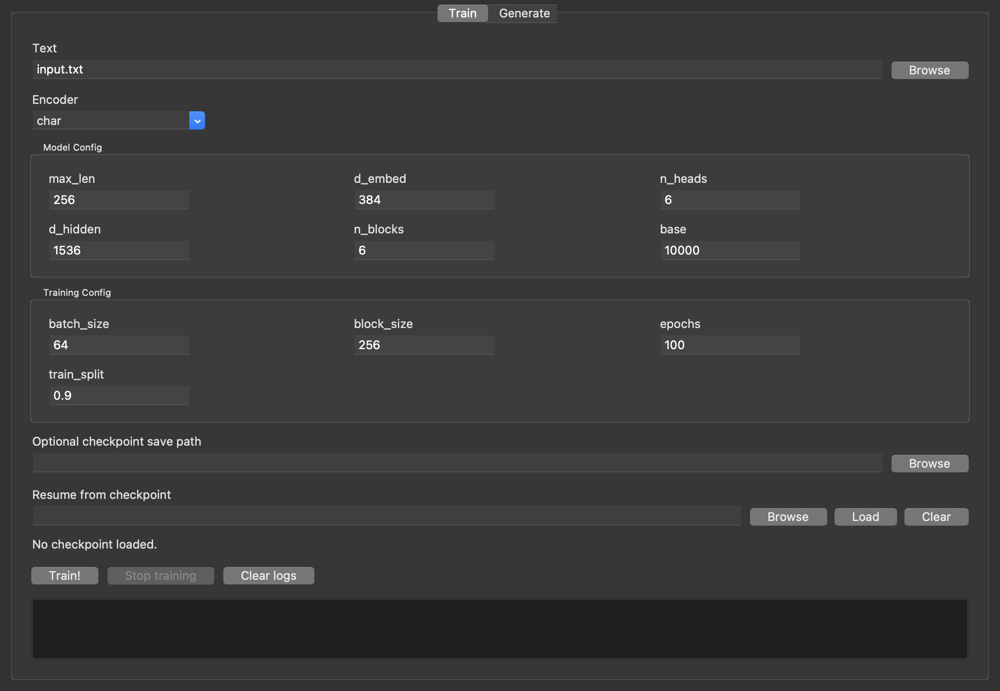

# Toy transformer impementation

- A simple implementation of a transformer model, focused on clarity rather than performance.
- It implements MHSA, RoPE, different encoder types, and a training loop with some example datasets.

### Installation

```bash
pip install -r requirements.txt
```

### Training

```python
text = open('input.txt', 'r').read()

model_config = dict(
    n_vocab=None,
    max_len=256,      # Expanded from 32! Model can now read/remember 256 characters at once
    d_embed=384,      # Increased from 128. Gives each token a much richer vector space
    n_heads=6,        # 384 / 6 = 64 head dimension (d_k stays 64, which is the sweet spot)
    d_hidden=1536,
    n_blocks=6,
    base=10_000
)

training_config = dict(
    batch_size=64,
    block_size=256,
    epochs=100,
    train_split=0.9
)

trainer = Trainer(
    encoder_type='char',
    text=text,
    model_config=model_config,
    training_config=training_config
)
trainer.train()
```

## GUI
There exists a GUI tool as well:
